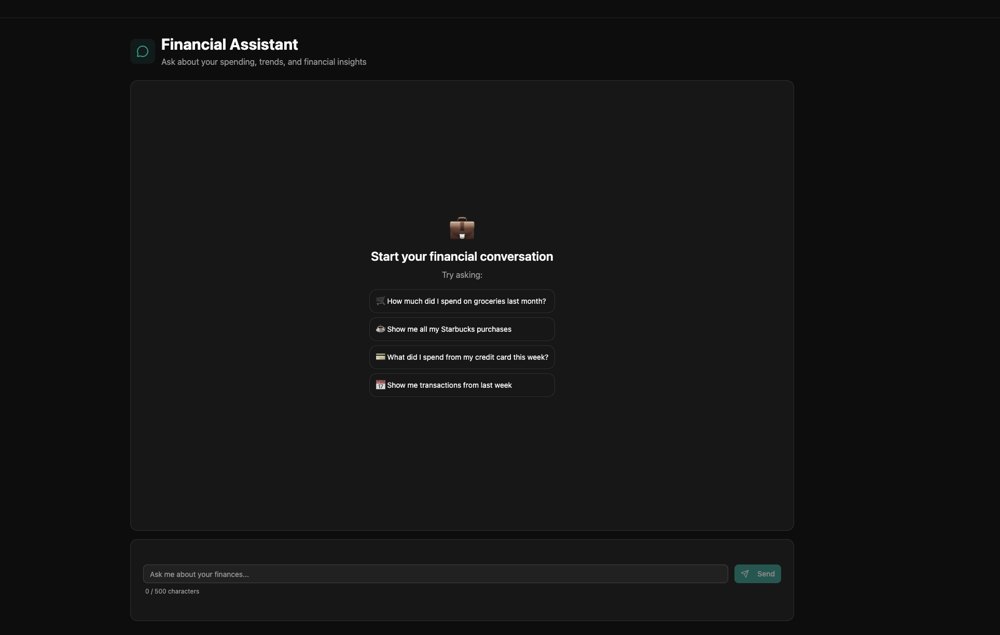
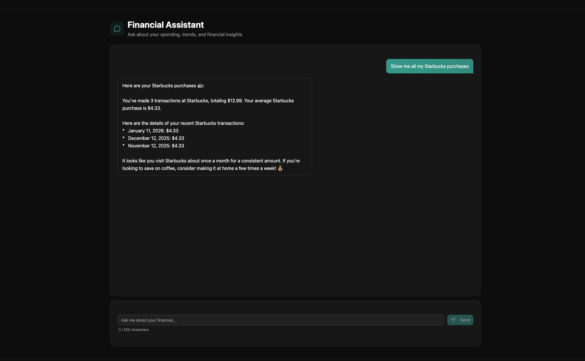

# WalletAI - AI-Powered Personal Finance Assistant

WalletAI is an intelligent personal finance assistant that connects to your bank accounts via Plaid and uses Google Gemini AI to answer questions about your spending habits, transactions, and financial patterns through natural language conversations.

### Chat Interface
<!-- Add screenshot: Chat interface with AI assistant -->


### Transaction Insights
<!-- Add screenshot: AI response showing transaction analysis -->


---

## How It Works

1. **Connect Your Bank** - Users link their bank accounts through Plaid's secure connection flow
2. **Sync Transactions** - WalletAI automatically syncs and stores your transactions in PostgreSQL
3. **Ask Questions** - Chat with the AI assistant using natural language queries
4. **Get Insights** - The LangGraph-powered agent analyzes your financial data and provides personalized insights

## Technology Stack

| Layer | Technologies |
|-------|-------------|
| **Frontend** | React, TypeScript, Vite, Tailwind CSS, shadcn/ui |
| **Backend** | FastAPI, SQLModel, PostgreSQL, Pydantic |
| **AI/ML** | LangGraph, LangChain, Google Gemini |
| **Banking** | Plaid API (Transactions Sync) |
| **Infrastructure** | Docker Compose, GitHub Actions |

## Quick Start

### Prerequisites

- Docker and Docker Compose
- Python 3.11+
- Node.js 18+
- API keys (see below)

### 1. Clone and Configure

```bash
git clone <repository-url>
cd WalletAI
cp .env.example .env
```

### 2. Set Up API Keys

Edit the `.env` file with your API keys:

```env
# Google Gemini API
GOOGLE_API_KEY=your_gemini_api_key

# Plaid API
PLAID_CLIENT_ID=your_plaid_client_id
PLAID_SECRET=your_plaid_secret
PLAID_ENV=sandbox
```

### 3. Run with Docker

```bash
docker compose up -d
```

The application will be available at:
- Frontend: http://localhost:5173
- Backend API: http://localhost:8000
- API Docs: http://localhost:8000/docs

### 4. Log In to Admin Account

Use the default superuser credentials (configured in `.env`):

| Field | Default Value |
|-------|---------------|
| Email | `admin@example.com` |
| Password | `changethis` |

> **Important**: Change these credentials before deploying to production by updating `FIRST_SUPERUSER` and `FIRST_SUPERUSER_PASSWORD` in your `.env` file.

### 5. Connect Your Bank

1. Navigate to the **Accounts** page
2. Click **Link Bank Account**
3. Follow the Plaid Link flow to connect your bank
4. For Sandbox testing, use Plaid's test credentials:
   - Username: `user_good`
   - Password: `pass_good`

---

## Getting API Keys

### Google Gemini API Key

1. Go to [Google AI Studio](https://aistudio.google.com/app/apikey)
2. Sign in with your Google account
3. Click "Create API Key"
4. Copy the key and add it to your `.env` as `GOOGLE_API_KEY`

### Plaid API Keys

1. Sign up at [Plaid Dashboard](https://dashboard.plaid.com/signup)
2. After verification, navigate to **Team Settings → Keys**
3. Copy your `client_id` and `secret` (use Sandbox keys for development)
4. Add them to your `.env` as `PLAID_CLIENT_ID` and `PLAID_SECRET`

> **Note**: Use `PLAID_ENV=sandbox` for development. Sandbox mode uses test credentials and doesn't connect to real banks.

---

## Project Architecture

```
WalletAI/
├── backend/                 # FastAPI Backend
│   ├── app/
│   │   ├── ai/              # LangGraph Agent
│   │   │   ├── agent.py     # Main agent graph builder
│   │   │   ├── state.py     # Agent state definitions
│   │   │   ├── nodes.py     # Processing nodes
│   │   │   ├── tools/       # AI tools for querying data
│   │   │   └── prompts.py   # System prompts
│   │   ├── api/             # REST API routes
│   │   │   └── routes/      # Chat, Plaid, Users endpoints
│   │   ├── core/            # Core services
│   │   │   ├── plaid_service.py    # Plaid API integration
│   │   │   ├── db_service.py       # Database operations
│   │   │   └── sync_orchestrator.py # Transaction sync
│   │   └── models.py        # SQLModel database models
│   └── tests/               # Pytest test suite
│
├── frontend/                # React Frontend
│   ├── src/
│   │   ├── components/
│   │   │   └── Chat/        # Chat interface components
│   │   ├── routes/          # TanStack Router pages
│   │   └── client/          # Auto-generated API client
│   └── tests/               # Playwright E2E tests
│
└── docker-compose.yml       # Container orchestration
```

---

## LangGraph Agent Architecture

WalletAI uses a **ReAct-style agent** built with LangGraph that dynamically decides which tools to call based on user queries.

### Agent Flow

```
┌─────────────────────────────────────────────────────────────┐
│                      User Message                            │
└─────────────────────────────────────────────────────────────┘
                              │
                              ▼
┌─────────────────────────────────────────────────────────────┐
│                     Agent Node (LLM)                         │
│  • Analyzes user query                                       │
│  • Decides which tools to call (if any)                     │
│  • Generates response or tool calls                          │
└─────────────────────────────────────────────────────────────┘
                              │
              ┌───────────────┴───────────────┐
              │                               │
        Tool Calls?                      No Tools
              │                               │
              ▼                               ▼
┌─────────────────────────┐     ┌─────────────────────────────┐
│       Tools Node        │     │      Return Response        │
│  • get_txns_by_category │     └─────────────────────────────┘
│  • get_txns_by_merchant │
│  • get_txns_by_account  │
│  • get_txns_between_dates│
└─────────────────────────┘
              │
              │ (loop back)
              ▼
┌─────────────────────────────────────────────────────────────┐
│                 Agent Node (Process Results)                 │
│  • Incorporates tool results                                 │
│  • Generates final response                                  │
└─────────────────────────────────────────────────────────────┘
```

### Available Tools

| Tool | Description |
|------|-------------|
| `get_transactions_by_category` | Query transactions by category (groceries, dining, etc.) |
| `get_transactions_by_merchant` | Find transactions from specific merchants |
| `get_transactions_by_account` | Filter transactions by account type |
| `get_transactions_between_dates` | Get transactions within a date range |

---

## Example Prompts

Here are some natural language queries you can ask WalletAI:

### Spending by Category
```
"How much did I spend on groceries last month?"
"What's my dining out spending this week?"
"Show me my entertainment expenses for January"
```

### Merchant Queries
```
"Show me all my Starbucks purchases"
"How much have I spent at Amazon this year?"
"Find my Netflix subscription charges"
```

### Account-Based Queries
```
"What did I spend from my credit card this week?"
"Show transactions from my checking account"
"List all debit card purchases last month"
```

### Date Range Queries
```
"Show me transactions from last week"
"What were my expenses between Jan 1 and Jan 15?"
"List all transactions from December"
```

### Comparison & Analysis
```
"Compare my spending this month vs last month"
"What's my biggest expense category?"
"Am I spending more on dining out than groceries?"
```

---

## Development

### Backend

```bash
cd backend
pip install -r requirements.txt  # or use uv
uvicorn app.main:app --reload
```

### Frontend

```bash
cd frontend
npm install
npm run dev
```

### Running Tests

```bash
# Backend tests
cd backend && pytest

# Frontend E2E tests
cd frontend && npx playwright test
```

---

## Documentation

- [Backend README](./backend/README.md) - Detailed backend setup
- [Frontend README](./frontend/README.md) - Frontend development guide
- [Deployment Guide](./deployment.md) - Production deployment
- [Development Guide](./development.md) - Local development setup

---

## Technology Stack and Features

- ⚡ [**FastAPI**](https://fastapi.tiangolo.com) for the Python backend API.
  - 🧰 [SQLModel](https://sqlmodel.tiangolo.com) for the Python SQL database interactions (ORM).
  - 🔍 [Pydantic](https://docs.pydantic.dev), used by FastAPI, for the data validation and settings management.
  - 💾 [PostgreSQL](https://www.postgresql.org) as the SQL database.
- 🚀 [React](https://react.dev) for the frontend.
  - 💃 Using TypeScript, hooks, [Vite](https://vitejs.dev), and other parts of a modern frontend stack.
  - 🎨 [Tailwind CSS](https://tailwindcss.com) and [shadcn/ui](https://ui.shadcn.com) for the frontend components.
  - 🤖 An automatically generated frontend client.
  - 🧪 [Playwright](https://playwright.dev) for End-to-End testing.
  - 🦇 Dark mode support.
- 🐋 [Docker Compose](https://www.docker.com) for development and production.
- 🔒 Secure password hashing by default.
- 🔑 JWT (JSON Web Token) authentication.
- 📫 Email based password recovery.
- 📬 [Mailcatcher](https://mailcatcher.me) for local email testing during development.
- ✅ Tests with [Pytest](https://pytest.org).
- 📞 [Traefik](https://traefik.io) as a reverse proxy / load balancer.
- 🚢 Deployment instructions using Docker Compose, including how to set up a frontend Traefik proxy to handle automatic HTTPS certificates.
- 🏭 CI (continuous integration) and CD (continuous deployment) based on GitHub Actions.

## License

MIT License - See [LICENSE](./LICENSE) for details.
